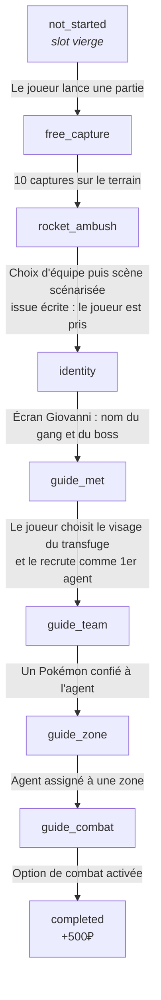
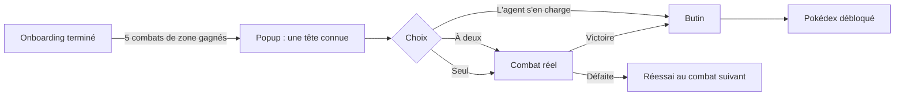

# Logigramme de l'introduction (Onboarding V2)

Référence du tunnel de première session : l'ordre des étapes, ce qui fait
avancer chacune, et ce qui se débloque à quel moment.

Ce document décrit le comportement **réel** du code, pas une intention de
design. Chaque valeur citée renvoie à sa source ; si vous changez une
constante, changez la ligne correspondante ici.

---

## 1. Vue d'ensemble



**Source des états** : `ONBOARDING_STEPS` dans
[modules/systems/onboardingFlow.js](../modules/systems/onboardingFlow.js).
La progression est linéaire et ne revient jamais en arrière : `_commitStep()`
refuse toute transition qui ne part pas de l'étape attendue, ce qui rend les
événements rejoués (double clic, reprise de save) inoffensifs.

---

## 2. Les étapes en détail

### `free_capture` — le terrain de départ

Le joueur débarque sur **Zone inconnue** (`unknown_field`) sans savoir où il
est. C'est la seule zone visible à ce stade.

| Élément | Valeur | Source |
|---|---|---|
| Objectif | **10 captures** | `ONBOARDING_CAPTURE_GOAL` |
| `spawnRate` | `0.5`, soit ~20× la Route 1 | [data/zones-data.js](../data/zones-data.js) |

Le `spawnRate` est volontairement énorme : l'objectif doit se boucler en
quelques minutes, pas occuper la moitié de la première session.

La zone est masquée du sélecteur dès l'onboarding terminé — voir
`_getActiveZones()` dans
[modules/ui/zoneSelector.js](../modules/ui/zoneSelector.js).

### `rocket_ambush` — l'embuscade

Trois sbires (`ONBOARDING_AMBUSH_GRUNTS`) entrent en scène. Le tirage de leurs
visages est **persisté** (`onboarding.ambushSprites`) : ce sont exactement les
candidats qui seront proposés plus tard comme transfuge, et le tirage survit à
un rechargement en pleine embuscade.

Séquence :

1. Popup de **choix d'équipe** — le slot 1 devient le starter, le joueur peut
   promouvoir un autre Pokémon
   ([onboardingAmbushPopup.js](../modules/ui/onboardingAmbushPopup.js)).
2. Le joueur **sort son premier Pokémon**.
3. Le sbire le raille : *« Parce que tu penses pouvoir te défendre face à nous ! »*
4. **Des renforts arrivent** (sbires classiques M/F).
5. Le joueur **se fait prendre** — issue écrite.

> **L'embuscade n'est plus un vrai combat.** Elle est jouée par le moteur de
> scène (`playScriptedAmbush()` dans
> [onboardingScene.js](../modules/ui/onboardingScene.js)). La défaite était de
> toute façon l'issue attendue — une équipe de première session contre six
> Pokémon — mais elle dépendait d'un tirage, et le moteur de combat imposait
> son rythme à un moment qui est narratif.
>
> Le chemin « vrai combat » subsiste comme filet : si un combat réel se
> déclenche dans la zone pendant cette étape (auto-combat d'un agent, par
> exemple), `COMBAT_WON`/`COMBAT_LOST` résout quand même l'embuscade.

### `identity` — Giovanni

Giovanni arrive **sur le terrain** et parle avant que son écran ne s'ouvre.
Cet écran demande le nom du gang et celui du boss.

Il cite le Pokémon réellement en tête d'équipe (`gang.bossTeam[0]`), pas la
première capture : le joueur a pu promouvoir un autre starter dans la popup
de choix d'équipe.

### `guide_met` → `completed` — le transfuge

Un des sbires reste sur le terrain : c'est le **transfuge**, à la fois premier
agent et guide. Il réclame une chose à la fois, et sa bulle porte la demande
en cours.

| Étape | Ce qu'il demande | Ce qui la valide |
|---|---|---|
| `guide_met` | « Prends-moi avec toi » | Le joueur choisit son visage et le recrute |
| `guide_team` | « Confie-moi un Pokémon » | `TEAM_MEMBER_SET` sur **son** id d'agent |
| `guide_zone` | « Assigne-moi à une zone » | `AGENT_ASSIGNED` avec une zone non nulle |
| `guide_combat` | « Active mon option de combat » | `AGENT_FLAG_CHANGED` `autoCombat = true` |

**Purge du terrain de départ.** Au clic sur l'étape `guide_team`, le joueur est
emmené dans l'onglet Agents et la fenêtre de la zone d'intro est **fermée** :
tout ce qui reste (équipe, zone, option de combat) se règle depuis Agents, et
la laisser ouverte affichait une fenêtre vide par-dessus le fogmap au retour.

**Défauts d'un agent recruté.** Un agent frais arrive avec `autoCombat: false`
et `autoRaid: false`, `autoCapture: true`
([modules/systems/agent.js](../modules/systems/agent.js)). C'est ce qui donne
son sens à la dernière étape : le transfuge demande d'activer une option qui
est réellement éteinte. Les agents des saves antérieures gardent leur
comportement — le code lit ces drapeaux en `!== false`, donc un `undefined`
hérité reste actif, et personne n'est désarmé rétroactivement.

### `completed`

- **+500₽** (`ONBOARDING_COMPLETION_REWARD`), versés une seule fois
  (`completionRewardGrantedAt` garde l'idempotence).
- Le terrain de départ sort du sélecteur **et** sa fenêtre est fermée : sinon
  le joueur garde à l'écran une zone qu'il ne peut plus jamais rouvrir.
- `introFlashbackOffered` passe à `true` : il vient de vivre la cinématique,
  on ne lui reproposera jamais en flashback.
- L'onglet **Marché** se débloque.

---

## 3. Déblocage des onglets

Quatre onglets sont **toujours** visibles : `tabZones`, `tabPC`, `tabAgents`,
`tabGang` (`BASE_TABS`). Les autres se méritent.

| Onglet | Condition | Règle |
|---|---|---|
| **Marché** | Onboarding terminé | `onboarding` |
| **Pokédex** | Scène du rival jouée (voir §4) | `flag` → `rivalPokedexUnlocked` |
| **Missions** | 5 captures depuis l'onboarding | `captures` ≥ 5 |
| **Journal** | 1 opération d'agent | `agentOps` ≥ 1 |
| **Compétition** | 50 réputation | `reputation` ≥ 50 |
| **Classement** | 100 réputation | `reputation` ≥ 100 |
| **Compte** | 1 session depuis l'onboarding | `sessions` ≥ 1 |

**Source** : `TAB_UNLOCK_RULES` dans
[data/tab-unlocks-data.js](../data/tab-unlocks-data.js), évalué par
[modules/systems/tabUnlocks.js](../modules/systems/tabUnlocks.js).

> **Piège de test.** Une save **sans `discoveryProgress`** est traitée comme
> antérieure à ce système : `migrateSave` lui ouvre **tous** les onglets, pour
> ne jamais retirer un onglet à un ancien joueur. C'est le cas des fixtures de
> `tools/dev-onboarding-fixtures.json`. Pour tester un déblocage, il faut donc
> forcer un `revealedTabs` explicite — sinon la condition est déjà satisfaite
> et le mur ne se déclenche jamais. Un vrai joueur n'est pas concerné : il part
> de `DEFAULT_STATE`, où `revealedTabs` est déjà un tableau vide.

---

## 4. Après l'onboarding

### Le mur du Pokédex (scène du rival)

L'onglet Pokédex n'est pas donné : il se prend sur un dresseur.



| Élément | Valeur |
|---|---|
| Seuil | **5** combats (`RIVAL_COMBAT_THRESHOLD`) |
| Dresseur | `rivalscout` — un Roucool niveau 3 |
| Drapeau posé | `discoveryProgress.rivalPokedexUnlocked` |

La scène est **one-shot** : `rivalSceneShown` passe à `true` dès l'ouverture de
la popup, pas à sa résolution. Seule la défaite en combat la réarme, pour ne
pas bloquer le tunnel sur un aléa.

Source : [modules/ui/rivalEncounterPopup.js](../modules/ui/rivalEncounterPopup.js).

### Autres apparitions ponctuelles

| Quoi | Quand | Drapeau |
|---|---|---|
| Popup « cadeau du transfuge » (objets) | Premier objet obtenu hors onboarding | `itemsIntroShown` |
| Offre de flashback de la cinématique | Save `completed` n'ayant jamais vu la scène | `introFlashbackOffered` |

Tous ces drapeaux vivent dans `state.discoveryProgress` et sont préservés par
`migrateSave` via un merge sur les défauts — un ajout de drapeau ne casse pas
les saves existantes.

---

## 5. Tester une étape précise

[tools/dev-onboarding-fixtures.json](../tools/dev-onboarding-fixtures.json)
porte une save partielle par étape. À coller dans la console :

```js
fetch('/tools/dev-onboarding-fixtures.json').then(r => r.json()).then(fixtures => {
  localStorage.setItem('pokeforge.v6', JSON.stringify(fixtures.guide_team));
  location.reload();
});
```

Clés disponibles : `free_capture`, `rocket_ambush`, `identity`, `guide_met`,
`guide_team`, `guide_combat`, `completed`.

**Deux réserves de méthode**, apprises en testant ce tunnel :

- Les Pokémon chargés ainsi n'ont **pas** de `.stats` (champ dérivé, retiré par
  `slimPokemon()` à la sauvegarde). Tout code de combat qui les lit plante.
  Reconstituez-les : `pk.stats = globalThis.calculateStats(pk)`.
- Voir aussi le piège `discoveryProgress` du §3.

### Tests automatisés

```bash
node tools/test-onboarding-flow.mjs
node tools/test-onboarding-controller.mjs
node tools/test-onboarding-scene.mjs
node tools/test-onboarding-payoff.mjs
node tools/test-onboarding-flashback.mjs
node tools/test-tab-unlocks.mjs
node tools/test-rival-encounter.mjs
```
